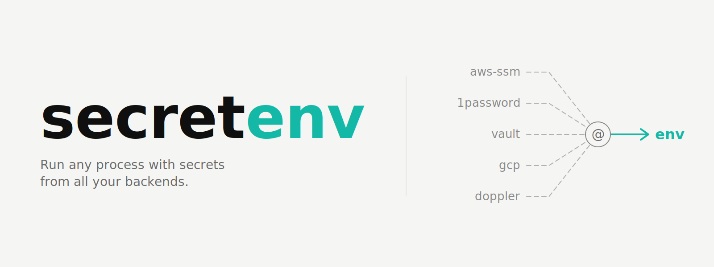

<div align="center">

<div align="center">
  
</div>

‎ 

[](LICENSE)
[](https://crates.io/crates/secretenv)
[](https://github.com/your-org/secretenv/actions)
[](#supported-backends)

*No SaaS. No re-encryption. No lock-in. No .env files.*

[Quick Start](#quick-start) · [How It Works](#how-it-works) · [Backends](#supported-backends) · [CLI Reference](#cli-reference) · [Security](#security) · [Docs](docs/)

</div>

---

## The Problem

Your org uses AWS SSM for infra credentials, 1Password for team secrets, and Vault for service tokens. Every developer has a slightly different `.env` file assembled from manual fetches across all three. New engineers spend their first day asking where things live. Offboarding is a manual checklist nobody fully trusts. Migrating from one backend to another means touching every repo.

Every existing tool assumes it is your only secrets backend. You have three.

---

## What secretenv Does

secretenv runs any command with secrets injected as environment variables, sourced from whatever combination of backends your team already uses — without storing, encrypting, or managing any secrets itself.

```bash
secretenv run -- npm start
secretenv run --registry dev -- python manage.py runserver
secretenv run --registry staging -- docker compose up
```

Secrets are fetched at runtime, injected into the child process, and gone when it exits. Nothing written to disk.

**secretenv is a coat of paint. If the walls aren't strong, the paint is useless. The walls are your backends.**

---

## How It Works

secretenv separates two things every other tool conflates:

| | What it is | Where it lives |
|---|---|---|
| **What secrets a project needs** | Alias names | `secretenv.toml` committed to every repo |
| **Where those secrets actually live** | Backend URIs | Alias registry in a backend you control |

### The Project Manifest

Every repo commits a `secretenv.toml` that declares which secrets it needs — using alias names, not backend paths. This file contains zero infrastructure information. It is safe to commit.

```toml
# secretenv.toml — committed to git
# Contains no secrets, no paths, no environment logic. Ever.

[secrets]
STRIPE_KEY      = { from = "secretenv://stripe-key" }
DATABASE_URL    = { from = "secretenv://db-url" }
DATADOG_API_KEY = { from = "secretenv://datadog-api-key" }
REDIS_URL       = { from = "secretenv://redis-url" }

# Static defaults — injected as-is, no backend involved
LOG_LEVEL       = { default = "info" }
APP_ENV         = { default = "development" }
```

Two value types. That's it. `secretenv://` aliases and static defaults. Direct backend URIs in this file are a hard error — the alias model exists precisely to keep infrastructure paths out of repos.

### The Alias Registry

A document stored in any backend your team already uses, mapping alias names to fully-qualified backend URIs:

```toml
# stored in aws-ssm-platform:///secretenv/registry
# managed via: secretenv registry set/unset/list

stripe-key      = "1password-work://payments/stripe/api_key"
db-url          = "aws-ssm-dev:///myapp/dev/db_url"
datadog-api-key = "1password-work://engineering/datadog/api_key"
redis-url       = "aws-ssm-dev:///myapp/dev/redis_url"
```

Change a backend? Update one line in the registry. Every repo picks it up automatically on the next run — no PRs, no re-encryption, no coordination.

### The Machine Config

Each developer's machine holds the credential topology — which named backend instances exist, where each registry lives. This file never touches a repo.

```toml
# ~/.config/secretenv/config.toml

[registries.default]
sources = ["aws-ssm-platform:///secretenv/org-registry"]

[registries.dev]
sources = [
  "aws-ssm-dev:///secretenv/dev-registry",       # team aliases, checked first
  "aws-ssm-platform:///secretenv/org-registry",  # org-wide fallback
]

[backends.aws-ssm-platform]
type        = "aws-ssm"
aws_profile = "platform"
aws_region  = "us-east-2"

[backends.aws-ssm-dev]
type        = "aws-ssm"
aws_profile = "dev"
aws_region  = "us-east-1"

[backends."1password-work"]
type       = "1password"
op_account = "company.1password.com"
```

### Resolution Flow

```
secretenv run --registry dev -- npm start

  secretenv.toml          alias registry              backends
  ──────────────          ──────────────              ────────
  STRIPE_KEY              stripe-key               1Password (work account)
    └─ secretenv:// ────►   └─ 1password-work:// ──► op read ...
  DATABASE_URL            db-url                   AWS SSM (dev account)
    └─ secretenv:// ────►   └─ aws-ssm-dev://   ──► aws ssm get-parameter --profile dev
  LOG_LEVEL               (static default)
    └─ "info" ──────────────────────────────────────► injected directly

  All resolved → injected into process env → npm start
```

---

## Quick Start

### Install

```bash
# macOS
brew install secretenv

# Linux / macOS (universal)
curl -sfS https://secretenv.dev/install.sh | sh

# Cargo
cargo install secretenv
```

### Configure Your Machine

Tell secretenv where your team's alias registry lives and configure your backend instances:

```bash
secretenv setup aws-ssm:///secretenv/registry

# ✓ Registry configured as [registries.default]
# ✓ Registry reachable: 12 aliases found
# ✓ AWS credentials detected (profile: default)
```

Or drop a `config.toml` directly at `~/.config/secretenv/config.toml`.

### Check Everything Is Ready

```bash
secretenv doctor

# ── Registries ───────────────────────────────────────────────────────
#   default
#     ✓ aws-ssm:///secretenv/registry    reachable via aws-ssm
#
# ── Backends ─────────────────────────────────────────────────────────
#   aws-ssm             (aws-ssm)
#     ✓ aws CLI v2.15.0
#     ✓ authenticated  profile=default  account=123456789  region=us-east-1
#
#   1password-work      (1password)
#     ✓ op CLI v2.24.0
#     ✓ authenticated  account=company.1password.com
```

### Add a `secretenv.toml` to Your Project

```toml
# secretenv.toml

[secrets]
STRIPE_KEY   = { from = "secretenv://stripe-key" }
DATABASE_URL = { from = "secretenv://db-url" }
API_KEY      = { from = "secretenv://internal-api-key" }
LOG_LEVEL    = { default = "info" }
```

### Run

```bash
secretenv run -- npm start
```

---

## Multiple Accounts and Backends

This is where secretenv earns its keep. Real organizations have multiple AWS accounts, multiple credential sets, and multiple backend tools. Named backend instances handle this without new plugins or new concepts — just configuration.

```toml
# ~/.config/secretenv/config.toml

# Three AWS accounts — one plugin, three named instances
[backends.aws-ssm-platform]
type        = "aws-ssm"
aws_profile = "platform"
aws_region  = "us-east-2"

[backends.aws-ssm-dev]
type        = "aws-ssm"
aws_profile = "dev"
aws_region  = "us-east-1"

[backends.aws-ssm-prod]
type        = "aws-ssm"
aws_profile = "prod"
aws_region  = "us-east-1"

# Two 1Password accounts
[backends."1password-work"]
type       = "1password"
op_account = "company.1password.com"

[backends."1password-personal"]
type       = "1password"
op_account = "personal.1password.com"
```

Registry entries reference named instances as their URI scheme:

```toml
# dev registry — aliases point to dev account
db-url     = "aws-ssm-dev:///myapp/dev/db_url"
stripe-key = "1password-work://payments/stripe/dev_key"

# prod registry — same alias names, different backends
db-url     = "aws-ssm-prod:///myapp/prod/db_url"
stripe-key = "1password-work://payments/stripe/prod_key"
```

The alias names stay identical across environments. The registry routing handles the rest.

---

## Selecting a Registry

```bash
# Use [registries.default] from config
secretenv run -- npm start

# Use a named registry from config
secretenv run --registry dev -- npm start
secretenv run --registry prod -- ./deploy.sh

# Use a direct URI — single source, no cascade
secretenv run --registry aws-ssm-dev:///secretenv/registry -- npm start
```

The `--registry` flag accepts either a name (looks up `[registries.<n>]` in config) or a direct URI (uses that document, no cascade). The same disambiguation applies to the `SECRETENV_REGISTRY` environment variable — the canonical mechanism for CI.

**Registry selection precedence:**

```
1. --registry <name-or-uri>          ← explicit per-invocation
2. SECRETENV_REGISTRY=<name-or-uri>  ← CI / shell-session override
3. [registries.default] in config    ← machine default
4. hard error                        ← no assumption made
```

---

## Cascading Registries

A registry can cascade across multiple sources. First match wins. Use this for team-specific aliases that shadow org-wide defaults.

```toml
[registries.dev]
sources = [
  "aws-ssm-dev:///secretenv/dev-registry",       # team aliases — checked first
  "aws-ssm-platform:///secretenv/org-registry",  # org-wide fallback
]
```

`stripe-key` in the dev registry shadows `stripe-key` in the org registry. The org-wide entry for `datadog-api-key` — which exists only in the org registry — resolves transparently from the fallback.

```bash
secretenv registry list --registry dev

# Registry: dev  (2 sources)
#
# aws-ssm-dev:///secretenv/dev-registry                    [source 1]
#   stripe-key       →  aws-ssm-dev:///myapp/dev/stripe_key
#   db-url           →  aws-ssm-dev:///myapp/dev/db_url
#
# aws-ssm-platform:///secretenv/org-registry               [source 2]
#   stripe-key       →  1password-work://payments/stripe    ↑ shadowed by source 1
#   datadog-api-key  →  1password-work://engineering/datadog
```

---

## Onboarding a New Engineer

The team lead shares one command:

```bash
secretenv setup aws-ssm:///secretenv/registry
```

The new engineer runs it, gets access through their normal IAM/Vault/Keeper provisioning, clones any repo, and runs. No key ceremonies. No re-encryption. No Slack thread asking where the Stripe key lives.

For teams using distribution profiles, it's one line:

```bash
curl -sfS https://secretenv.dev/install.sh | sh -s -- --profile acme-corp
```

This installs the binary and pre-populates `~/.config/secretenv/config.toml` with all named instances, all registry sources, and all backend configurations for your org. The new engineer's `doctor` output is clean from the first run.

---

## Offboarding an Engineer

Revoke the departing engineer's access to the registry backend. One operation in IAM, Vault, or 1Password. Done.

They can no longer resolve any alias. They can no longer fetch any secret via secretenv. The revocation is immediate and covers every repo simultaneously — no re-encryption, no manual checklist, no "did we get all of them."

---

## Backend Migration

Moving secrets from one backend to another — SSM to Vault, Keeper to 1Password, anything to anything — is a one-line registry update:

```bash
# Before: stripe-key lives in 1Password
secretenv registry get stripe-key
# stripe-key → 1password-work://payments/stripe/api_key

# After migration: update the alias to point to new location
secretenv registry set stripe-key "vault-prod://secret/payments/stripe_key"

# Every repo picks this up on the next secretenv run
# No PRs. No re-encryption. No coordination.
```

The secret migration itself — moving the value from 1Password to Vault — is a one-time operation using your existing tools. Once the value is in the new backend, the registry update makes it live everywhere instantly.

---

## Managing the Registry

```bash
# List all aliases and their sources
secretenv registry list
secretenv registry list --registry dev

# Inspect a single alias
secretenv registry get stripe-key

# Add or update an alias
secretenv registry set stripe-key "1password-work://payments/stripe/api_key"

# Remove an alias
secretenv registry unset old-deprecated-key

# Show history (where supported by the backend)
secretenv registry history

# Generate the onboarding command for a new team member
secretenv registry invite
```

Writes always go to source[0] of the active registry. To write to a specific source, pass a direct URI:

```bash
secretenv registry set stripe-key "..." \
  --registry aws-ssm-platform:///secretenv/org-registry
```

---

## CI/CD Integration

secretenv works in CI via the `SECRETENV_REGISTRY` environment variable. Set it once at the org or repo level in your CI platform — no config file needed on the runner.

**GitHub Actions:**

```yaml
jobs:
  deploy:
    runs-on: ubuntu-latest
    permissions:
      id-token: write
    steps:
      - uses: aws-actions/configure-aws-credentials@v4
        with:
          role-to-assume: arn:aws:iam::123456789012:role/github-actions-role
          aws-region: us-east-1

      - name: Install secretenv
        run: curl -sfS https://secretenv.dev/install.sh | sh

      - name: Run with secrets
        env:
          SECRETENV_REGISTRY: aws-ssm:///secretenv/registry
        run: secretenv run -- ./deploy.sh
```

**Jenkins** (persistent agents): install secretenv on the agent, set `SECRETENV_REGISTRY` as a global environment variable, configure backend CLIs with appropriate service account credentials. `secretenv doctor` on the agent validates the setup.

For a full CI/CD guide see [docs/ci-cd.md](docs/ci-cd.md).

---

## Supported Backends

secretenv delegates all authentication to each backend's native CLI. Authentication is always handled by the backend's own tooling — secretenv inherits whatever credentials are already configured on the machine.

| Backend | Type | URI Scheme | CLI Required |
|---|---|---|---|
| AWS SSM Parameter Store | `aws-ssm` | `aws-ssm-<instance>:///path` | `aws` |
| AWS Secrets Manager | `aws-secrets` | `aws-secrets-<instance>://name` | `aws` |
| GCP Secret Manager | `gcp` | `gcp-<instance>://project/secret` | `gcloud` |
| Azure Key Vault | `azure` | `azure-<instance>://vault/secret` | `az` |
| HashiCorp Vault | `vault` | `vault-<instance>://mount/path` | `vault` |
| OpenBao | `openbao` | `openbao-<instance>://mount/path` | `bao` |
| CyberArk Conjur | `conjur` | `conjur-<instance>://account/path` | `conjur` |
| Delinea Secret Server | `delinea` | `delinea-<instance>://folder/secret` | `tss` |
| 1Password | `1password` | `1password-<instance>://vault/item/field` | `op` |
| Doppler | `doppler` | `doppler-<instance>://project/config/secret` | `doppler` |
| Infisical | `infisical` | `infisical-<instance>://project/env/path` | `infisical` |
| Bitwarden Secrets Manager | `bitwarden` | `bitwarden-<instance>://organization/secret` | `bws` |
| Keeper | `keeper` | `keeper-<instance>://folder/item/field` | `keeper` |
| macOS Keychain | `keychain` | `keychain-<instance>://service/account` | `security` |
| Linux Secret Service | `secret-service` | `secret-service-<instance>://collection/label` | `secret-tool` |
| Local file | `local` | `local:///path/to/registry.toml` | — |

The URI scheme is your named instance. Multiple instances of the same backend type — for multiple accounts, multiple vaults, or multiple credential sets — are configured in `config.toml` and referenced by their instance name.

> **secretenv never calls cloud APIs directly.** Every fetch is a shell-out to the native CLI. This means secretenv inherits your MFA, SSO, biometric unlock, and any other auth your backend requires — with no new auth surface to audit.

---

## CLI Reference

```
secretenv
├── run [--registry <name-or-uri>] [--dry-run] [--verbose] -- <command>
│
├── registry
│   ├── list   [--registry <name-or-uri>]
│   ├── get    <alias>  [--registry <name-or-uri>]
│   ├── set    <alias> <backend-uri>  [--registry <name-or-uri>]
│   ├── unset  <alias>  [--registry <name-or-uri>]
│   ├── history  [--registry <name-or-uri>]
│   └── invite
│
├── setup <registry-uri>
│
├── doctor [--extensive] [--json]
│
├── resolve <alias> [--registry <name-or-uri>]
└── get <alias> [--registry <name-or-uri>]
```

**Global flags:**

```
--registry <name-or-uri>   Named registry from config, or direct URI
--dry-run                  Show what would be injected without running
--verbose                  Show full resolution steps
--json                     Machine-readable output (doctor only)
```

**Environment variables:**

```
SECRETENV_REGISTRY=<name-or-uri>   Registry override — primary CI mechanism
```

---

## Security

secretenv is not a security product. It is a workflow product that eliminates a class of workflow-driven security failures.

**secretenv does not make your secrets more secure. It makes your team less likely to handle them insecurely. For most teams, habits are where the actual breaches happen.**

### What secretenv protects against

- Secrets committed to git accidentally — eliminated, nothing to commit
- Secrets sitting on disk in plaintext — eliminated, nothing written
- Infrastructure paths exposed in repos — eliminated, aliases only
- Manual offboarding gaps — one backend access revocation covers everything
- Backend lock-in — registry update migrates every repo simultaneously
- Stale secrets — fetched at runtime, rotation is immediately transparent

### What secretenv does not protect against

- Machine compromise — if the machine is owned, active backend sessions are inherited. This is true for every secrets tool. The real defense is credential scoping at the backend level, not the tool choice.
- Post-injection process exposure — once secrets are injected as env vars, they are readable by any process running as the same user. This is a property of the env var model, not a secretenv issue.
- Registry document access — the alias registry maps alias names to backend paths. Treat its access controls accordingly. If a bad actor has your registry, they already have authenticated backend access — topology exposure is the least of your concerns at that point.

### The full threat model comparison

A detailed comparison across `.env` files, `direnv`, `op run`, `doppler run`, `fnox`, and secretenv — covering 14 threat categories — is in [docs/security.md](docs/security.md).

### No new auth surface

secretenv has no credential storage, no login command, and no auth surface of its own. If your backend is authenticated, secretenv works. If it isn't, secretenv fails with the same error the native CLI would give you. Fix it there.

---

## Plugin Architecture

The core is an SDK. It parses `secretenv.toml`, resolves `--registry` to a source list, fetches registry documents, resolves aliases, fetches secret values, and injects them into the child process. That's it. The core never knows about AWS, Vault, 1Password, or any specific backend — it only speaks the trait interface below.

Every backend is an independent Rust crate in `crates/backends/` implementing **two** traits defined in `secretenv-core`:

```rust
#[async_trait]
pub trait Backend: Send + Sync {
    fn backend_type(&self) -> &str;
    fn instance_name(&self) -> &str;
    async fn check(&self) -> BackendStatus;
    async fn get(&self, uri: &BackendUri) -> Result<String>;
    async fn set(&self, uri: &BackendUri, value: &str) -> Result<()>;
    async fn delete(&self, uri: &BackendUri) -> Result<()>;
    async fn list(&self, uri: &BackendUri) -> Result<Vec<(String, String)>>;
}

pub trait BackendFactory: Send + Sync {
    fn backend_type(&self) -> &str;
    fn create(
        &self,
        instance_name: &str,
        config: HashMap<String, String>,
    ) -> Result<Box<dyn Backend>>;
}
```

Every backend crate registers one `BackendFactory`. At startup, the core iterates `[backends.*]` blocks in `config.toml` and calls each factory with the raw config fields — plugins own their own validation; the core stays blind to what fields each plugin expects. This keeps the core binary immutable: adding a new backend is a new crate plus one line of factory registration, never a change to core.

`async_trait` is used from day one. v0.1 fetches secrets sequentially; parallelism becomes a one-line change in v0.2 thanks to the async surface.

All backends are compiled into the single binary. No feature flags to configure, no profiled builds to choose between. The presence (or absence) of `[backends.<name>]` in `config.toml` determines which backends are active at runtime.

For the step-by-step guide to writing a new backend, see [docs/adding-a-backend.md](docs/adding-a-backend.md).

---

## Why Not...

**`op run` / `doppler run`** — Single backend only. If your team uses anything other than 1Password or Doppler respectively, these tools don't help. Migrating away requires touching every repo that references their paths.

**`direnv`** — Shell hook model requires writing custom glue per project. Backend integration is manual scripting. Paths live in `.envrc` files. No standard for what a project needs or where things live.

**`fnox`** — Multi-backend and thoughtfully designed, but built around the `mise` ecosystem. Age encryption mode requires re-encrypting secrets across repos when team membership changes — a real operational burden at microservice scale. secretenv has no re-encryption concept because it stores nothing.

**Pulumi ESC** — Multi-backend, solid architecture, but requires a Pulumi Cloud account. Not local-first. Adds a SaaS dependency to your secrets workflow.

**`.env` files** — Manual, error-prone, accumulate stale values, get committed accidentally, sit on disk in plaintext, make offboarding a checklist nobody fully trusts. This is the workflow secretenv replaces.

---

## Contributing

secretenv is built in Rust and welcomes contributions. The easiest entry point is adding a new backend — each one is a self-contained crate with a focused, well-defined interface.

```bash
git clone https://github.com/your-org/secretenv
cd secretenv
cargo build
cargo test
```

See [CONTRIBUTING.md](CONTRIBUTING.md) for the full guide and [docs/adding-a-backend.md](docs/adding-a-backend.md) for the backend development walkthrough.

Issues tagged [`good first issue`](https://github.com/your-org/secretenv/issues?q=label%3A%22good+first+issue%22) are scoped for first-time contributors. Each new backend is a meaningful, isolated OSS contribution.

---

## License

MIT — see [LICENSE](LICENSE).

---

<div align="center">

Built with frustration at `.env` files and too many password managers.

**[⭐ Star on GitHub](https://github.com/your-org/secretenv)**

</div>
