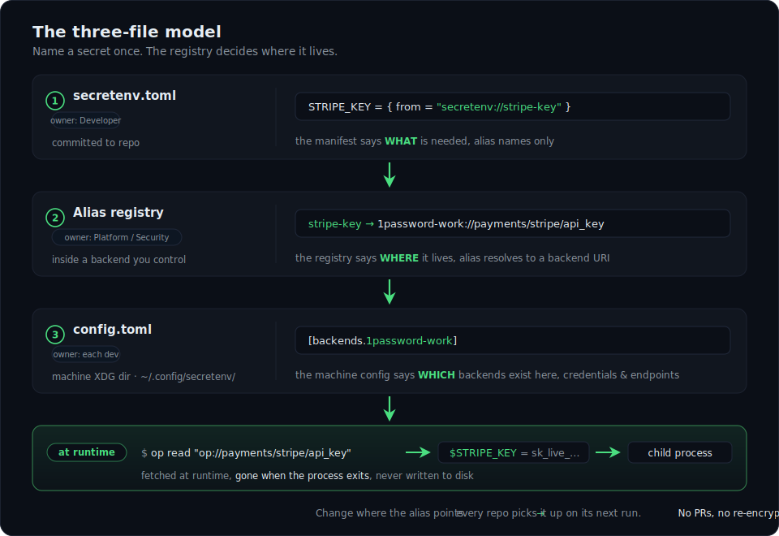

<div align="center">

# secretenv

<!-- MEDIA: badges-row-extended
     Add when available: tests-count, contributors, downloads, last-release-date, MSRV
-->
[](LICENSE)
[](https://crates.io/crates/secretenv)
[](https://github.com/TechAlchemistX/secretenv/actions)
[](#supported-backends)
[](#stability-proof)

### Multi-backend secrets orchestration using alias registry

**One registry. Every repo. Every backend. Migrate without touching a single repo.**

*No SaaS. No re-encryption. No lock-in. No .env files.*

[Quick Start](#quick-start) · [How It Works](#the-three-file-model) · [Workflows](#workflows) · [Backends](#supported-backends) · [CLI](#cli) · [Compare](#how-it-compares) · [Security](#security) · [Docs](docs/README.md)

</div>

---

## The problem

Your org uses AWS SSM for infra credentials, 1Password for team secrets, and Vault for service tokens. Every developer hand-assembles a `.env` from all three. New hires spend day one asking where things live; offboarding is a checklist nobody fully trusts; migrating one backend to another means touching every repo.

Every other tool assumes it's your *only* secrets backend. You have three. Or four. Or five.

## What it does

`secretenv run` injects secrets as environment variables into any command, sourced from whatever mix of backends your team already uses, without storing, encrypting, or managing any secret itself. It orchestrates your existing backends through an **alias registry that lives in your own backend**: name a secret once in the repo manifest, and change where the alias points to update every repo on its next run. No PRs, no re-encryption, no coordination.

```bash
secretenv run -- npm start
secretenv run --registry staging -- ./deploy.sh
```

Secrets are fetched at runtime, injected into the child process, and gone when it exits. **No secret values are written to disk.**

**SecretEnv is a workflow product, not a security product.** It removes the most common vectors for secrets-in-git and secrets-on-disk; auth, encryption, and storage stay exactly where they already are.

---

## The three-file model

SecretEnv separates three things every other tool conflates: **three files, three owners, three lifecycles.** Reading a repo teaches you nothing about backend topology, because topology never enters the repo.

<p align="center">
  
</p>

Every repo commits only alias names. Here's an example manifest:

```toml
# secretenv.toml: committed to git. Alias names only; backend paths are a hard error.
[secrets]
STRIPE_KEY   = { from = "secretenv://stripe-key" }
DATABASE_URL = { from = "secretenv://db-url" }
LOG_LEVEL    = { default = "info" }
```

Change a backend? Update one line in the registry; every repo picks it up on its next run. Because the registry lives in a backend you control, you manage it with the access controls, audit trails, and versioning you already trust.

> Full schemas, validation rules, and the 5-phase resolution flow: **[The three-file model, deep](docs/reference/three-file-model-deep.md)**.

---

## Quick start

```bash
# 1. Install (macOS / universal / cargo)
brew install secretenv
curl -sfS https://secretenv.io/install.sh | sh
cargo install secretenv

# 2. Point your machine at a registry
secretenv setup aws-ssm:///secretenv/registry --region us-east-1

# 3. Confirm every backend is installed + authenticated
secretenv doctor

# 4. Add a secretenv.toml (see above), then run
secretenv run -- npm start
```

New to the model? Browse the **[documentation](docs/README.md)**.

---

## Workflows

The four workflows SecretEnv was built for.

**1 · Onboard a new engineer.** The platform team publishes one profile; onboarding is two commands.

```bash
secretenv profile install acme-corp --url https://internal.acme.com/secretenv/acme-corp.toml
secretenv doctor
```

The profile carries every backend instance and registry source the team has converged on. No copy-paste from a wiki, no Slack thread asking where Stripe lives. → [Profiles](docs/reference/profiles.md)

**2 · Deploy across environments.** The same `secretenv.toml` runs in dev, staging, and prod; only the registry selection changes.

```bash
secretenv run --registry prod -- ./deploy.sh
```

Each registry maps the same alias names to env-specific backends. The repo never knows which AWS account or Vault namespace it's running against. → [Registries & cascading](docs/reference/registry.md)

**3 · Migrate a backend without touching repos.** Move a secret from 1Password to Vault in one command.

```bash
secretenv registry migrate stripe-key "vault-prod://secret/payments/stripe_key" --dry-run
secretenv registry migrate stripe-key "vault-prod://secret/payments/stripe_key"
```

Read from the source, write to the destination, flip the registry pointer atomically. The source value is kept by default (`--delete-source` removes it after a separate prompt). Every repo picks up the change on its next run. → [Migrate](docs/reference/migrate.md)

**4 · Offboard an engineer.** Revoke their access to the registry backend. One operation in IAM, Vault, or 1Password covers every repo at once. Immediate, no re-encryption, no manual checklist.

> Rolling SecretEnv out org-wide is its own playbook: **[Adoption guide](docs/guides/rollout.md)**.

---

## Supported backends

SecretEnv delegates all authentication to each backend's native CLI, so it inherits your MFA, SSO, and biometric unlock and **adds no new auth surface to audit**. All 15 backends compile into one binary: no plugins, no feature flags. The presence of `[backends.<name>]` in your config decides which are active.

| Backend | Type | Tested CLI |
|---|---|---|
| [Local file](docs/backends/local.md) | `local` | `std::fs` |
| [AWS SSM Parameter Store](docs/backends/aws-ssm.md) | `aws-ssm` | aws-cli v2.34.35+ |
| [AWS Secrets Manager](docs/backends/aws-secrets.md) | `aws-secrets` | aws-cli v2.34.35+ |
| [1Password](docs/backends/1password.md) | `1password` | op v2.34.0+ |
| [HashiCorp Vault](docs/backends/vault.md) | `vault` | vault v2.0.0+ |
| [GCP Secret Manager](docs/backends/gcp.md) | `gcp` | gcloud v560.0.0+ |
| [Azure Key Vault](docs/backends/azure.md) | `azure` | azure-cli v2.85.0+ |
| [macOS Keychain](docs/backends/keychain.md) | `keychain` | `security` (macOS only) |
| [Doppler](docs/backends/doppler.md) | `doppler` | doppler v3.76.0+ |
| [Infisical](docs/backends/infisical.md) | `infisical` | infisical v0.43.79+ |
| [Keeper](docs/backends/keeper.md) | `keeper` | Commander v17.2.13+ |
| [Cloudflare Workers KV](docs/backends/cf-kv.md) | `cf-kv` | wrangler v4.85.0+ |
| [OpenBao](docs/backends/openbao.md) | `openbao` | bao v2.5.3+ |
| [CyberArk Conjur](docs/backends/conjur.md) | `conjur` | conjur v8.1.3+ (Go) |
| [Bitwarden Secrets Manager](docs/backends/bitwarden-sm.md) | `bitwarden-sm` | bws v2.0.0+ |
| Delinea Secret Server | `delinea` | *coming soon* |

Each page covers the URI scheme, config fields, authentication, `doctor` output, and examples. URI fragment directives (`#json-key`, `#version`) are documented in the [fragment vocabulary](docs/reference/fragment-vocabulary.md). Start at the **[backend index](docs/backends/README.md)** for selection guidance.

> **SecretEnv never calls cloud APIs directly.** Every fetch is a shell-out to the native CLI, so it inherits whatever auth your backend already enforces, with no new authentication surface.

---

## CLI

```bash
secretenv run      [--registry <name|uri>] [--dry-run] [--verbose] [--redact] -- <command>
secretenv registry list | get | set | unset | migrate | history | invite
secretenv profile  install | list | update | uninstall
secretenv doctor   [--json] [--fix] [--extensive] [--trace]
secretenv setup    <registry-uri> [--region R] [--profile P] [--vault-address …]
secretenv redact   <path> [--in-place] [--backup <suffix>] [--dry-run]
secretenv mcp      serve | disable | enable | setup | audit
secretenv resolve | get | completions
```

Key environment variables: 
- `SECRETENV_REGISTRY` (registry override, the primary CI mechanism)
- `SECRETENV_PROFILE_URL`
- `RUST_LOG=secretenv=debug`

> Every command, every flag, every exit code: **[CLI reference](docs/reference/cli-reference-full.md)**.

---

## CI/CD

In CI you authenticate the backend CLI, not SecretEnv. That works exactly as it would if you were calling the CLI directly, and SecretEnv adds no auth layer. Set the registry once via an env var:

```yaml
- run: curl -sfS https://secretenv.io/install.sh | sh
- env:
    SECRETENV_REGISTRY: aws-ssm:///secretenv/registry
  run: secretenv run -- ./deploy.sh
```

Per-platform patterns (GitHub Actions OIDC, GitLab Vault JWT, Jenkins/BuildKite agent-baked CLIs, CircleCI contexts): **[CI/CD guide](docs/guides/ci-cd.md)**.

---

## Health & observability

**`secretenv doctor`** is the front door for onboarding validation, CI pre-deploy gates, and on-call triage. It runs three levels of checks in parallel:

- **L1**: is the backend's CLI installed?
- **L2**: is the backend authenticated?
- **L3**: is each registry source readable? (`--extensive` only)

`--json` runs under 2s for a 10-backend topology; `--fix` walks interactive remediation. → [doctor reference](docs/reference/cli-reference-full.md#secretenv-doctor)

**OpenTelemetry**: opt-in traces and metrics for every resolution, backend probe, MCP tool call, and registry mutation:

- One-line setup: point `OTEL_EXPORTER_OTLP_ENDPOINT` at any OTLP/gRPC collector.
- No endpoint? No exporter is installed, with zero startup overhead.
- Every attribute is ALLOW/DENY-classified at compile time; there's no `set_attribute` escape hatch.

→ [OpenTelemetry reference](docs/reference/opentelemetry.md)

**Two guarantees worth stating plainly:**

- **All-or-nothing per invocation.** If any required alias fails to resolve, the child process never starts. Partial environments are never injected.
- **No on-disk cache.** Every run hits live backends, so rotation is transparent on the next run.

---

## How it compares

| Property | **SecretEnv** | `.env` | fnox¹ | direnv |
|---|---|---|---|---|
| Multi-backend in one invocation | **✓** | n/a | ✓ | manual per-project |
| Backend migration without editing repos | **✓** (one `registry set`) | n/a | ✗ (edit every `fnox.toml`) | n/a |
| Infrastructure topology hidden from repos | **✓** (aliases only) | ✗ | ✓ (ciphertext or refs) | ✗ (paths in `.envrc`) |
| Centrally-shared mutable alias registry | **✓** (in your backend) | n/a | n/a | n/a |
| One-line offboarding (single revoke covers all repos) | **✓** | ✗ | ✗ (age) / ✓ (KMS) | ✗ |
| Stores no secret material on disk | **✓** | ✗ | depends¹ | **✓** |
| No SaaS dependency | **✓** | ✓ | ✓ | ✓ |
| Inherits backend MFA / SSO / biometric | **✓** (native CLI) | n/a | partial | n/a |

¹ **fnox** is multi-mode. Age mode keeps an age private key on disk; KMS modes gate decryption on IAM with no persistent disk key. SecretEnv's distinction is orthogonal to encryption: the alias-registry layer removes backend topology from every repo, so a migration is one `registry set` instead of editing every config.

**Pick SecretEnv if** you run 2+ backends and want one onboarding/offboarding story, want infrastructure topology hidden from your repos, or operate across local dev + CI + persistent runners and want one tool for all three.

**Pick something else if** you're committed to a single backend (`op run` / `doppler run` are simpler and more deeply integrated), you're all-Kubernetes (External Secrets Operator), you need a hosted policy/audit/rotation service (Pulumi ESC, Vault Enterprise, CyberArk Conjur), or you need at-rest file encryption for gitops (sops, or fnox in KMS mode).

> Per-tool deep dives for `.env`, fnox, direnv, op run, doppler run, Pulumi ESC, External Secrets Operator, sops, and Vault/Conjur: **[comparisons](docs/comparisons/README.md)**.

---

## Security

> **SecretEnv is not a security product. It's a workflow product that removes the most common vectors for secrets-in-git and secrets-on-disk, the failures that happen at scale.**

The model is simple: SecretEnv has no credential storage, no login command, and no auth surface of its own. If your backend is authenticated, SecretEnv works. If it isn't, SecretEnv fails with the same error the native CLI would give you.

**What it eliminates**: secrets committed to git (nothing to commit), secret values on disk (nothing written), infrastructure paths in repos (aliases only), manual offboarding gaps (one revoke covers everything), and backend lock-in (a registry update migrates every repo at once).

**What it deliberately does not do**: defend a compromised machine, protect secrets after injection (a property of the env-var model), replace platform-native runtime injection for ECS/Lambda/Kubernetes, provide encryption-at-rest (that belongs to your backend), or replace policy engines, audit services, and rotation orchestration (it routes to them).

**Redaction (v0.14+)** scrubs resolved values from child-process stdout/stderr by default, falling back to `exec()` for interactive TTYs; `secretenv redact <path>` cleans existing files post-hoc.

> Full 14-category threat model vs `.env`, direnv, op run, doppler run, and fnox: **[threat model](docs/security.md)**. Responsible disclosure: **[SECURITY.md](SECURITY.md)**.

---

## Stability proof

Every backend tool claims stability. The smoke harness *proves* it: it exercises the **real binary** against **real backend CLIs** in **real shells**, not mocks, not contract tests. **779 assertions across 15 backends as of v0.19.0.**

<p align="center">
  
</p>

> The assertion count for **every** release since v0.2.0, plus methodology: **[Stability & smoke-test history](docs/stability.md)**.

---

## Architecture

The core is an SDK. It parses `secretenv.toml`, resolves `--registry` to a source list, fetches registry documents, resolves aliases, fetches secret values in parallel, and injects them into the child process. It never knows about AWS, Vault, 1Password, or any specific backend; it only speaks the trait interface. Each backend is an independent crate in `crates/backends/`, and adding one is a new crate plus one line of factory registration, never a change to core.

> Trait interface and step-by-step guide: **[Adding a backend](docs/reference/adding-a-backend.md)**.

---

## Contributing

SecretEnv is built in Rust. The easiest entry point is adding a new backend, a self-contained crate with a focused, well-defined interface.

```bash
git clone https://github.com/TechAlchemistX/secretenv && cd secretenv
cargo build && cargo test
```

See [CONTRIBUTING.md](CONTRIBUTING.md) for the full guide. Issues tagged [`good first issue`](https://github.com/TechAlchemistX/secretenv/issues?q=label%3A%22good+first+issue%22) are scoped for first-time contributors.

---

## License

**GNU Affero General Public License v3.0 (AGPL-3.0-only)**. See [LICENSE](LICENSE). Free to use, modify, and redistribute.

**§13 triggers only when you deploy a *modified fork* as a network service**: you must then offer its source to that service's users. Using SecretEnv as a CLI inside your organization, even commercially, is unaffected. (v0.1 and v0.2.0 were MIT; v0.3.0 onward is AGPL-3.0-only.)

Contributions are welcome under the project's [Contributor License Agreement](CLA.md). **No CLA, no merge.**

---

<div align="center">

Built with frustration at `.env` files and too many password managers.

**[⭐ Star on GitHub](https://github.com/TechAlchemistX/secretenv)** · **[All docs](docs/README.md)** · **[Threat model](docs/security.md)** · **[Add a backend](docs/reference/adding-a-backend.md)**

</div>
