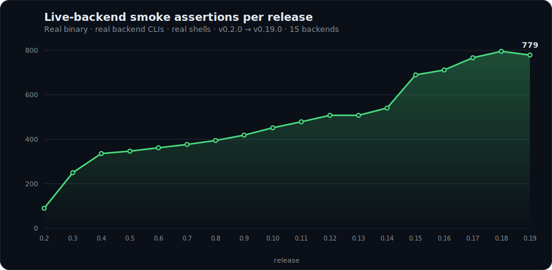

# Stability & smoke-test history

Every backend tool claims stability. SecretEnv proves it on every release.

The smoke harness exercises the **real binary** against **real backend CLIs** in **real shells**, not mocks, not contract tests. Each assertion does the whole thing: spawn the CLI, route input via tempfile or stdin, parse stdout, handle stderr, observe the exit code. The harness lives at [`scripts/smoke-test/`](https://github.com/TechAlchemistX/secretenv/tree/main/scripts/smoke-test) and runs against the operator's live backend accounts before any tag is pushed.

## Why this matters

In the v0.13 cycle the harness caught a latent pipe-deadlock in the Infisical backend that had survived **15 days and 6 release cycles** since Infisical shipped in v0.7.0. CI was green every release. Unit tests passed. Three-agent audits passed. Only the live smoke (the real binary against the real CLI in a real shell) surfaced it. The fix was one line; the lesson was the harness.

## Assertions per release

The integration smoke harness began at v0.2.0; v0.1.x predate it. The count tracks the **full-matrix** run across every configured backend.

| Release | Date | Backends | Assertions | Notable addition |
|---|---|---:|---:|---|
| v0.2.0 | 2026-04-18 | 5 | ~90 | First integration smoke (local, AWS SSM, AWS Secrets, 1Password, Vault) |
| v0.3.0 | 2026-04-19 | 7 | 250 | +GCP Secret Manager, +Azure Key Vault |
| v0.4.0 | 2026-04-22 | 7 | 336 | Functionality cycle, `doctor --fix/--extensive`, `registry history/invite`, profiles |
| v0.5.0 | 2026-04-22 | 8 | 347 | +macOS Keychain |
| v0.6.0 | 2026-04-22 | 9 | 362 | +Doppler |
| v0.7.0 | 2026-04-22 | 10 | 377 | +Infisical |
| v0.8.0 | 2026-04-24 | 11 | 395 | +Keeper |
| v0.9.0 | 2026-04-25 | 12 | 419 | +Cloudflare Workers KV |
| v0.10.0 | 2026-04-27 | 13 | 452 | +OpenBao |
| v0.11.0 | 2026-04-30 | 14 | 479 | +CyberArk Conjur |
| v0.12.0 | 2026-05-05 | 15 | 508 | +Bitwarden Secrets Manager (15th backend) |
| v0.13.0 | 2026-05-06 | 15 | 508 | Hygiene cycle, caught the v0.7-era Infisical pipe-deadlock |
| v0.14.0 | 2026-05-15 | 15 | 541 | +`secretenv redact` (runtime + post-hoc) |
| v0.15.0 | 2026-05-20 | 15 | 690 | +`registry migrate` |
| v0.16.0 | 2026-05-24 | 15 | 712 | +MCP server |
| v0.17.0 | 2026-05-28 | 15 | 767 | +OpenTelemetry |
| v0.18.0 | 2026-06-04 | 15 | 796 | Hardening #1, security / telemetry / MCP closures |
| v0.19.0 | 2026-06-14 | 15 | 779 | Hardening #2, doc-vs-code audit, probe-vocabulary unification |

Test surface grew alongside feature surface across a single-backend-per-minor-release cadence. Two reading notes:

- **Hardening cycles add no backends, and the assertion count can move down.** v0.19 consolidated and re-scoped a handful of telemetry assertions, so its full-matrix total (779) sits just below v0.18's (796). Fewer assertions here means a tighter suite, not less coverage.
- **Patch and hygiene releases re-validate rather than extend.** Merged-not-tagged hygiene cycles (v0.7.1, v0.9.1, v0.16.1, v0.16.2, and others) re-run the prior minor's baseline matrix to confirm no regression; they don't add new assertions, so they aren't plotted above.

## Methodology

- **No mocks.** Every assertion runs the shipped binary end to end against a live backend account.
- **Pre-tag gate.** A green full-matrix run is required before any version tag is pushed.
- **Expected skips are explicit.** A run reports `PASS / FAIL / SKIP`; skips are pre-declared (e.g. a UUID-gated fixture, a TTY-only PTY case) and never mask a failure.
- **Environment failures are distinguished from code failures.** A first-run failure traced to an expired backend session is re-run after re-auth, not counted as a code defect.
